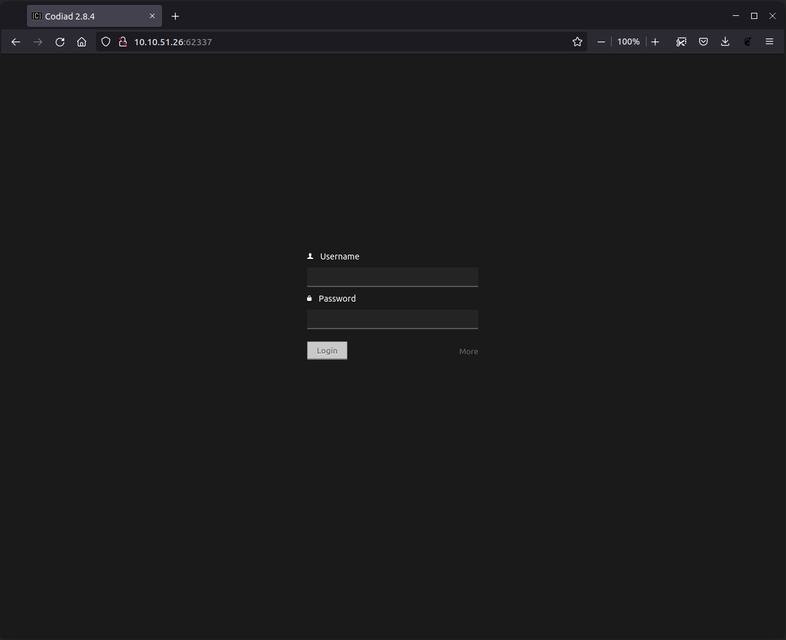
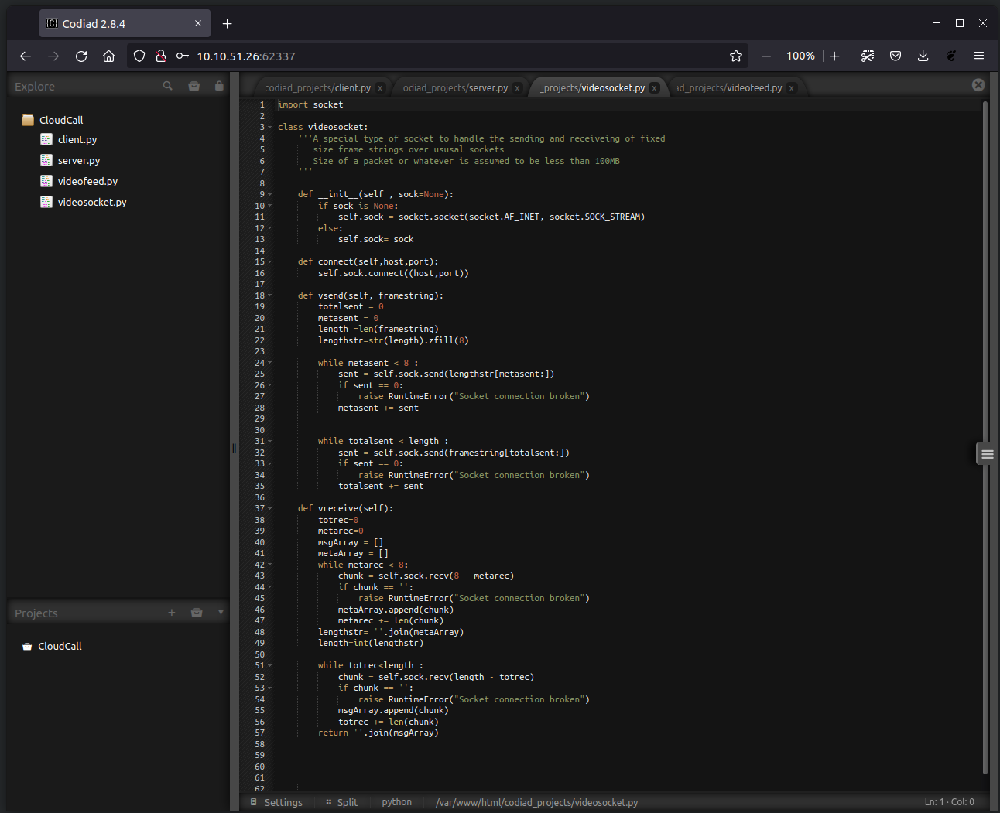

#


# IDE

An easy box to polish your enumeration skills

> The IP address seen here is relative to what is assigned by TryHackMe at the moment of starting the box and therefore can and will change for every time it's restarted so if different IPs are seen throughout the document note that this box wasn't completed in one session. If you wish to copy any of the commands shown here please change the IP to the one relevant to your current session.

### Enumeration

Initial nmap scan showed various open ports:

```
sudo nmap -sV -sC -p- -oA nmap 10.10.51.26
Starting Nmap 7.80 ( https://nmap.org ) at 2022-03-25 20:19 AST
Nmap scan report for 10.10.51.26
Host is up (0.14s latency).
Not shown: 65531 closed ports
PORT      STATE SERVICE VERSION
21/tcp    open  ftp     vsftpd 3.0.3
|_ftp-anon: Anonymous FTP login allowed (FTP code 230)
| ftp-syst: 
|   STAT: 
| FTP server status:
|      Connected to ::ffff:10.6.5.230
|      Logged in as ftp
|      TYPE: ASCII
|      No session bandwidth limit
|      Session timeout in seconds is 300
|      Control connection is plain text
|      Data connections will be plain text
|      At session startup, client count was 4
|      vsFTPd 3.0.3 - secure, fast, stable
|_End of status
22/tcp    open  ssh     OpenSSH 7.6p1 Ubuntu 4ubuntu0.3 (Ubuntu Linux; protocol 2.0)
| ssh-hostkey: 
|   2048 e2:be:d3:3c:e8:76:81:ef:47:7e:d0:43:d4:28:14:28 (RSA)
|   256 a8:82:e9:61:e4:bb:61:af:9f:3a:19:3b:64:bc:de:87 (ECDSA)
|_  256 24:46:75:a7:63:39:b6:3c:e9:f1:fc:a4:13:51:63:20 (ED25519)
80/tcp    open  http    Apache httpd 2.4.29 ((Ubuntu))
|_http-server-header: Apache/2.4.29 (Ubuntu)
|_http-title: Apache2 Ubuntu Default Page: It works
62337/tcp open  http    Apache httpd 2.4.29 ((Ubuntu))
|_http-server-header: Apache/2.4.29 (Ubuntu)
|_http-title: Codiad 2.8.4
Service Info: OSs: Unix, Linux; CPE: cpe:/o:linux:linux_kernel

Service detection performed. Please report any incorrect results at https://nmap.org/submit/ .
Nmap done: 1 IP address (1 host up) scanned in 826.85 seconds         ~13m:46s 

```

> NOTE: port 62337 will not show under a regular nmap scan due to it being over the common 1000 ports that nmap scans by default. This means that the `'-p-'` flag must be set in order for it to show up and continue with the assestmen.

### Initial access

The ftp server allows for anonymous login with no password giving us the chance to see a limited section of the file system as the ftp user.

```
 ftp 10.10.51.26
Connected to 10.10.51.26.
220 (vsFTPd 3.0.3)
Name (10.10.51.26:dfaults): anonymous
331 Please specify the password.
Password:
230 Login successful.
Remote system type is UNIX.
Using binary mode to transfer files.
ftp> ls -la
200 PORT command successful. Consider using PASV.
150 Here comes the directory listing.
drwxr-xr-x    3 0        114          4096 Jun 18  2021 .
drwxr-xr-x    3 0        114          4096 Jun 18  2021 ..
drwxr-xr-x    2 0        0            4096 Jun 18  2021 ...
226 Directory send OK.
ftp> cd ...
250 Directory successfully changed.
ftp> ls -la
200 PORT command successful. Consider using PASV.
150 Here comes the directory listing.
-rw-r--r--    1 0        0             151 Jun 18  2021 -
drwxr-xr-x    2 0        0            4096 Jun 18  2021 .
drwxr-xr-x    3 0        114          4096 Jun 18  2021 ..
226 Directory send OK.
ftp> get -
local: ./- remote: -
200 PORT command successful. Consider using PASV.
150 Opening BINARY mode data connection for - (151 bytes).
226 Transfer complete.
151 bytes received in 0.00 secs (174.3037 kB/s)
ftp> quit
221 Goodbye.  
```

After seing the file system the directory `...` stood out due to it not being a normal directory within a linux system as the directory most similar to it would be while trying to go up one level in the directory as shown with the command `cd ..`. Once entered in this odd directory the file `-` is relevant as it's hidden from a regulas `ls` listing and due to it having read and write permissions using the `get -` command will download the file onto our local machine for further inspection since the server does not provide the tools in order to view this file directly on the server. Once on the local system we can use the `more -` command in order to see it's contents as the `cat` or `less` commands will not work properly for reasons i am yet unaware of.

After running the correct command we get this output:

```
more -
Hey john,
I have reset the password as you have asked. Please use the default password to login. 
Also, please take care of the image file ;)
- drac.


```

### Web server access

When trying to acces the web server on port 62337 we can see this login page:



### Web dashboard credentials

Credentials for the login page was just a simple guess of typical default passwords as refered to by the letter in the `-` document leaving us with access to the Codiad 2.8.4 site using

```
Username: john
Password: password
```

While we explored the Codiad dashboard nikto was left running in the backgroud as a good measure and use of time in case any potential vulnerabilities were present.



The nikto enumeration resulted in the following:

```
nikto -host http://10.10.51.26:62337/ -o nikto-enumeration.txt
- Nikto v2.1.5
---------------------------------------------------------------------------
+ Target IP:          10.10.51.26
+ Target Hostname:    10.10.51.26
+ Target Port:        62337
+ Start Time:         2022-03-26 00:00:08 (GMT-4)
---------------------------------------------------------------------------
+ Server: Apache/2.4.29 (Ubuntu)
+ The anti-clickjacking X-Frame-Options header is not present.
+ Cookie f9c7294bc8f6035df784b56b800b122c created without the httponly flag
+ No CGI Directories found (use '-C all' to force check all possible dirs)
+ Server leaks inodes via ETags, header found with file /favicon.ico, fields: 0x47e 0x5c5045aa328fe 
+ DEBUG HTTP verb may show server debugging information. See http://msdn.microsoft.com/en-us/library/e8z01xdh%28VS.80%29.aspx for details.
+ /config.php: PHP Config file may contain database IDs and passwords.
+ OSVDB-3268: /data/: Directory indexing found.
+ OSVDB-3092: /data/: This might be interesting...
+ OSVDB-3268: /lib/: Directory indexing found.
+ OSVDB-3092: /lib/: This might be interesting...
+ OSVDB-3092: /INSTALL.txt: Default file found.
+ OSVDB-3092: /LICENSE.txt: License file found may identify site software.
+ OSVDB-3233: /icons/README: Apache default file found.
+ Cookie 1ec459e58a8a15e1c36cd5a362f66d20 created without the httponly flag
+ 6544 items checked: 0 error(s) and 13 item(s) reported on remote host
+ End Time:           2022-03-26 00:16:40 (GMT-4) (992 seconds)
---------------------------------------------------------------------------
+ 1 host(s) tested                                                                                                                                                                                                                                  ~16m:32s 

```
